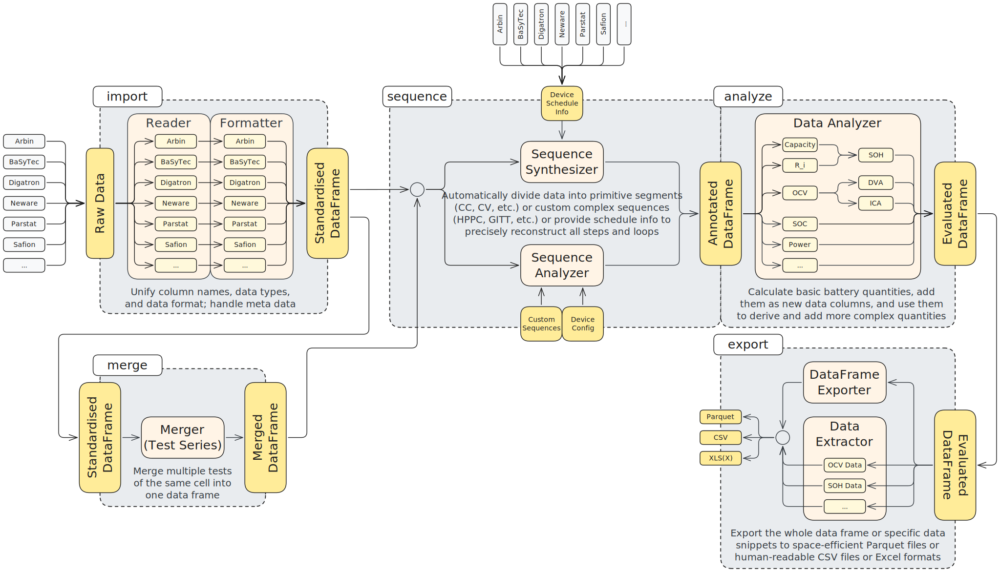

# PyDPEET - Fast and Easy Battery Data Unification, Processing, and Analysis

<!-- ## Contact
Just in case of future expansion to, e.g., Matrix or a blog or a YouTube channel -->

<!-- ## Technical Components
alternatively: "Dependencies"
Probably not necessary? -->

## Project Goals

PyDPEET is a Python package developed to handle battery measurement data from various cyclers and other measurement devices by
* converting input data into a standardised format using Pandas data frames,
* allowing users to merge multiple single tests into test series of one cell, and multiple test series into multi-cell measurement campaigns, and
* adding sequence info either by automatically synthesising from an existing schedule or automatically analysing in case of unknown measurement procedure.

Standardised data can then be analysed using various functions which add additional data columns to a data frame:
* power, energy, capacity,
* inner resistance,
* state of charge (SOC), state of health (SOH),
* OCV points, DVA and ICA,
* and more...

Processed data can be exported to highly efficient Parquet files to be stored and re-imported later -- or to CSV or XLSX formats to maintain legacy workflows.

## Documentation



### Autogenerated Docs

* [PyDPEET homepage](https://eet-tub.github.io/pydpeet/)
* [Installation](https://eet-tub.github.io/pydpeet/installation.html)
* [Quickstart](https://eet-tub.github.io/pydpeet/quickstart.html)
* [API reference](https://eet-tub.github.io/pydpeet/api/index.html)
* [Example notebooks](https://eet-tub.github.io/pydpeet/examples/notebooks/index.html)

### Nested READMEs

* TODO: ref to 'io' docs?
* TODO: ref to 'merge' docs?
* TODO: ref to 'sequence' docs?
* TODO: ref to 'analyze' docs?
<!-- * TODO: ref to 'visualize' docs? (FUTURE) -->
<!-- * TODO: ref to 'modelling' docs? (FUTURE) -->

<!-- ### Wiki
Necessary or even feasible with parallel GitLab and Github setups? -->

## Installation

### For Users

PyDPEET is available at PyPI. To install, simply use `pip`:

```
pip install pydpeet
```

### For Developers

1. Set up a suitable development environment (e.g., VS Code).
2. If you want to be able to edit Jupyter notebooks, make sure to create a python environment with an `ipykernel` (e.g., using `conda`).
3. Clone the PyDPEET repo:
    ```
    git clone https://github.com/eet-tub/pydpeet.git
    ```
4. Install PyDPEET in [editable mode](https://pip.pypa.io/en/stable/cli/pip_install/#cmdoption-e) from your local Git repo:
    ```
    pip install -e .
    ```
5. Install the `pre-commit` package:
    ```
    pip install pre-commit
    ```
    or
    ```
    conda install -n <your env> pre-commit
    ```
6. Refer to [Development Guidelines](#development-guidelines) and [Development Workflow](#development-workflow) for more details.

## Current Status

## Roadmap

<!-- ## FAQ -->

## Citing PyDPEET

## Contributing to PyDPEET

### Reporting Issues

### Request for Data Conversion

### Development Guidelines

### Development Workflow

#### Basic Setup

#### Pre-Commit Hook

#### Autogeneration

#### Linting and Formatting