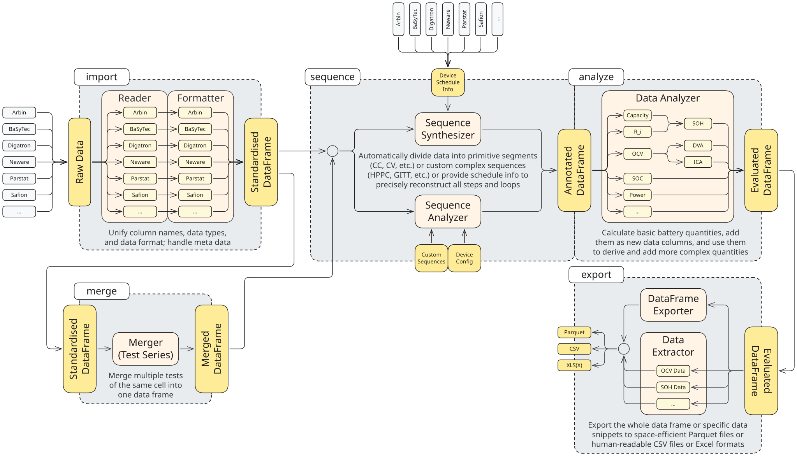

<div align="center">

[](https://github.com/eet-tub/pydpeet/releases)
[](https://pypi.org/project/pydpeet/)
[](https://eet-tub.github.io/pydpeet/)
[](LICENSE)

</div>

<!-- [](https://pypi.org/project/pydpeet/)
[](https://github.com/eet-tub/pydpeet/actions/workflows/github-ci.yml)
[](https://doi.org/<DOI>)
[](https://codecov.io/gh/eet-tub/pydpeet)
[](https://pypi.org/project/pydpeet/)
[](...) -->

# PyDPEET - Fast and Easy Battery Data Unification, Processing, and Analysis

## Contact

Feel free to open an issue on GitHub or use our email for direct enquiries: pydpeet@eet.tu-berlin.de.

<!-- ## Technical Components
alternatively: "Dependencies"
Probably not necessary? -->

## Project Goals

PyDPEET is a Python package developed to handle battery measurement data from various cyclers and other measurement devices by
* converting input data into a standardised format using Pandas data frames,
* allowing users to merge multiple single tests into test series of one cell, and multiple test series into multi-cell measurement campaigns, and
* adding sequence info either by automatically synthesising from an existing schedule or automatically analysing in case of unknown measurement procedure.

Standardised data can then be analysed using various functions which add additional data columns to a data frame:
* power, energy, capacity,
* inner resistance,
* state of charge (SOC), state of health (SOH),
* OCV points, DVA and ICA,
* and more...

Processed data can be exported to highly efficient Parquet files to be stored and re-imported later -- or to CSV or XLSX formats to maintain legacy workflows.

## Citing PyDPEET

## Documentation



### GitHub Pages

* [PyDPEET homepage](https://eet-tub.github.io/pydpeet/latest/)
* [Installation](https://eet-tub.github.io/pydpeet/latest/installation.html)
* [API reference](https://eet-tub.github.io/pydpeet/latest/api/index.html)
* [Examples](https://eet-tub.github.io/pydpeet/latest/examples/index.html)
* [Developer Guide](https://eet-tub.github.io/pydpeet/latest/developer.html)

## Installation

### For Users

Install PyDPEET directly from PyPI using uv or pip.

```
uv add pydpeet
```

or

```
pip install pydpeet
```

For detailed installation instructions, see the [installation guide](https://eet-tub.github.io/pydpeet/latest/installation.html) at our GitHub Pages.

### For Developers

Please refer to the [developer guide](https://eet-tub.github.io/pydpeet/latest/developer.html) at our GitHub Pages.

<!-- ## Current Status -->

## Roadmap

Planned features and ongoing work are tracked in the [Roadmap](https://github.com/orgs/eet-tub/projects/3) at our GitHub Projects.

<!-- ## FAQ -->

## Contributing to PyDPEET

### Reporting Issues

If you encounter an issue, please open a GitHub issue and provide as much information as possible, including:

- a minimal reproducible example
- cycler model
- software version
- export settings
- battery information
- error messages and stack traces (if available)

### Request for Data Conversion
If PyDPEET cannot read or convert your data, please open an issue or send us sample data via email (pydpeet@eet.tu-berlin.de).

- cycler model
- software version
- export settings
- battery type
- measurement description

### Contributing New Features

Contributions are always welcome! If you would like to add a new feature, we recommend discussing your idea in a GitHub issue before starting implementation. This helps avoid duplicate work and ensures that the proposed functionality aligns with the project's goals.

Please refer to the [Developer Guide](https://eet-tub.github.io/pydpeet/latest/developer.html) for information on setting up a development environment, coding standards, testing, documentation, and the pull request workflow.
