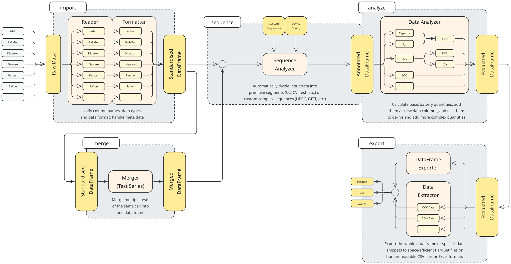

# Summary

# Statement of Need

Experimental battery research generates large amounts of measurement data from a wide range of battery cyclers and electrochemical measurement systems. These systems commonly use vendor-specific file formats, column names, units, metadata structures, and representations of experimental procedures. Consequently, substantial preprocessing is often required before measurement data can be analysed. In many research workflows, this preprocessing is implemented through experiment- or device-specific scripts, making analyses difficult to transfer between datasets and measurement systems.

At the same time, battery characterization increasingly relies on combinations of different experiments and analysis methods. Measurements from individual tests often need to be combined into test series or larger measurement campaigns, while subsequent analyses require a consistent representation of quantities such as voltage, current, time, capacity, energy, state of charge, or test steps. Reimplementing these processing steps for individual projects increases development effort and can reduce reproducibility and comparability between studies.

There is therefore a need for a reusable and measurement-system-independent processing framework that transforms heterogeneous raw battery measurement data into a consistent and structured representation for subsequent analysis. Such a framework should reduce experiment-specific preprocessing, facilitate the reuse of analysis methods across datasets, and improve reproducibility and comparability between studies. PyDPEET was developed to address this need

# State of the Field

<!-- - Es gibt viele verschiedene software(teile), die sich mit der Auswertung und verarbeiten von Batteriemessdaten auseinadersetzen. Häufig sind sie spezialisert auf bestimmte dinge. Zum Beispiel 
- EIS/DRT [@murbach_impedancepy_2020; @wan_influence_2015; @huang_joint-domain_2026]
- Degradation mode Analysis [@rehm_how_2026; @dubarry_synthesize_2012]
- Zeitreihen (@holland_pyprobe_2025, @wind_cellpy_2024)
- other (@herring_beep_2020) -->

Open-source software for battery data processing and analysis spans a wide range of applications and levels of specialization. Several tools focus on individual characterization or diagnostic methods. For example, dedicated tools exist for electrochemical impedance spectroscopy and distribution of relaxation times analysis [@murbach_impedancepy_2020; @wan_influence_2015; @huang_joint-domain_2026], degradation mode analysis [@dubarry_synthesize_2012; @rehm_how_2026], and the extraction of model-relevant parameters from techniques such as incremental capacity analysis or galvanostatic intermittent titration [@randall_ampworks_2025].

More general frameworks have been developed to process battery cycling data across different experiments and measurement systems, but they differ in the abstractions used to represent experimental procedures and in the extent of the processing workflow they cover. Cellpy [@wind_cellpy_2024] supports multiple battery cyclers, harmonizes their data into a common representation, automatically derives step- and cycle-level information, and provides analysis methods such as ICA and DVA. Recent versions additionally support merging multiple tests, including tests from different cells, into campaign-like data structures. PyProBE [@holland_pyprobe_2025] similarly converts data from several commonly used cyclers into a standardized representation and organizes measurements into cells, procedures, experiments, cycles, and steps. While cycle and event information are represented based on the imported step information, the corresponding experimental information must be manually defined by the user for each test, typically through an accompanying description of the experimental procedure, and is not inferred automatically from the measurement data. BEEP [@herring_beep_2020] follows a different emphasis, combining the structuring of cycling data with feature extraction and workflows for battery lifetime prediction. DATTES [@redondo-iglesias_dattes_2023] provides a broad processing workflow ranging from proprietary cycler-data conversion to automatic segmentation of experiments into operating phases and subsequent analyses including capacity, resistance, impedance, OCV, ICA, and DVA. The battery-data-toolkit focuses primarily on consistently structured battery datasets, metadata, and reusable post-processing functions, providing a common data representation for subsequent analysis. At a more fundamental level, the Battery Data Format defines a standardized and semantically described representation of battery time-series data and provides tools for importing, converting, validating, and cleaning data from different sources.

Consequently, existing frameworks cover substantial parts of the battery data-processing workflow, but use different approaches to describe the experimental structure. Some rely primarily on step and cycle information provided by the measurement system, others require additional descriptions of the experimental procedure, while others automatically segment measurements into operating phases. In particular, the automatic reconstruction of higher-level experimental sequences from measurement data, and their subsequent organization across tests and cells, is not consistently addressed across existing frameworks.

| Software                 | Multi-cycler import | Unified format | Automatic step detection | Automatic higher-level sequence detection | Multi-test series | Multi-cell campaigns | General analysis | Diagnostic analysis |
| ------------------------ | :-----------------: | :------------: | :----------------------: | :---------------------------------------: | :---------------: | :------------------: | :--------------: | :-----------------: |
| **Cellpy**               |          X          |        X       |             X            |                     --                    |         X         |           X          |         X        |          X          |
| **PyProBE**              |          X          |        X       |            (X)           |                     --                    |         X         |          (X)         |         X        |          X          |
| **BEEP**                 |          X          |        X       |            --            |                     --                    |         --        |          (X)         |         X        |         (X)         |
| **DATTES**               |          X          |        X       |             X            |                    (X)                    |        (X)        |          (X)         |         X        |          X          |
| **battery-data-toolkit** |         (X)         |        X       |            --            |                     --                    |        (X)        |          (X)         |         X        |          --         |
| **Battery Data Format**  |          X          |        X       |            --            |                     --                    |         --        |          --          |        (X)       |          --         |
| **PyDPEET**              |          X          |        X       |             X            |                     X                     |         X         |           X          |         X        |          X          |

The comparison distinguishes the frameworks according to their support for data import and harmonization, representation of experimental procedures, automatic reconstruction of operating steps, and aggregation across tests or cells. Most frameworks support the first aspect, whereas the representation and reconstruction of higher-level experimental sequences differ substantially. Cellpy and PyProBE provide structured data models for cycling measurements, while DATTES additionally derives operating phases from the data. In most cases, however, higher-level sequences must be defined by the user or inferred from existing cycler information. Support for combining multiple tests or cells is also available in several frameworks, but is not generally linked to automatic procedure reconstruction.

PyDPEET integrates these functions in a common processing workflow. Data from different measurement systems are converted into a unified representation, elementary operating steps are identified from the measurements, and these steps are combined into higher-level experimental sequences. Individual tests can subsequently be grouped into test series and measurements from multiple cells into campaigns while preserving the reconstructed structure. Thus, PyDPEET enables the analysis of heterogeneous datasets even when the original test schedule is unavailable. This enables experimental information to be reconstructed even when the original test schedule or an explicit description of the measurement procedure is unavailable.

# Software Design

PyDPEET's main goal is to provide an easy-to-use, fast, and consistent library that can be easily integrated into existing workflows. Since many scientists in the field of battery research rely on Python scripts to read, analyse, and visualise their data, Python was chosen as the software's primary language. PyDPEET is already available as a package on PyPI and GitHub and provides an autogenerated API layer to give users top-level access to all relevant functions. The automatically updated GitHub Pages provide installation and development guidelines, an API reference generated from extensive docstrings, and in-depth tutorials covering the most common usecases.

To keep PyDPEET as lightweight as possible, the list of dependencies is kept at a minimum and additional resource files only consist of PARQUET and TXT files for unit tests and "Sequence Analyzer" precompilation. The codebase itself uses a modular approach to allow future extension within existing submodules (see Fig. \ref{fig:Design_Overview}) as well as the addition of new submodules. The aforementioned top-level function calls ensure that users are unaffected by most internal changes.

Fig. \ref{fig:Design_Overview} shows PyDPEET's general workflow. It uses a straightforward pipeline: first, input battery data is read, converted, and unified ("io" submodule); secondly, time series can be automatically divided into useful chunks for further analysis ("process/sequence" submodule); thirdly, data can be analysed using various functions for typical battery-related quantities ("process/analyze" submodule); lastly, evaluated data can be exported ("io" submodule). The "process/merge" submodule is an optional path for users who want to merge time series from multiple data files into a single file while retaining chronological order. All internal functionality is achieved using the PARQUET file format. This table-based format is fast to process, enables high compression rates for typical input files in the MB-to-GB range, and can be easily converted into other typical formats, e.g., CSV or XLSX.

In addition to its functionality, a strong focus of the project is maintainability: PyDPEET already contains a test suite which is currently used for basic unit tests. Each commit triggers these tests as well as a linting and formatting stage which uses Ruff and mypy to enforce formal code quality. The merge pipeline adds stages to build and deploy GitHub Pages for the latest state. Releases produce release-specific GitHub Pages and accompanying PyPI version updates.

<!--TODO: Unified columns-->
<!--TODO: Pandas DataFrame-->
<!--TODO: Open-source software + license-->
<!--TODO: Citations (both directions incl. integration)-->

# Research Impact Statement

<!-- 
Durch viele Abschlussarbeiten (Bachelor und Master) genutzt und zum Teil weiterentwickelt
Mit großem interesse auf der Advanced Battery Power 2026 Conference Vorgestellt[@otto_pydpeet_2026] und verwendet für [@schlosser_automated_2026].
 -->

# AI Usage Disclosure

Generative AI tools were used to assist with code suggestions, debugging, documentation, website development, and improving the wording of the manuscript. All AI-assisted output was reviewed, validated, and, where necessary, revised by the authors.