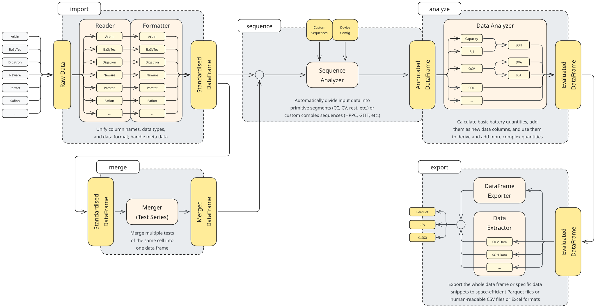

# Summary

Experimental battery research produces large amounts of heterogeneous data from laboratory and field applications, often stored in incompatible formats and representations that hinder reproducible analysis. PyDPEET is a Python package for importing, harmonising, structuring, and analysing experimental battery data. It provides a common data representation, automatically identifies operating steps and higher-level experimental sequences, and supports the organisation of individual tests into test series and multi-cell measurement campaigns. Its modular and extensible architecture facilitates the addition of new data readers and analysis functions which enables reusable workflows across measurement systems and reduces the need for device- and project-specific code.

# Statement of Need

Experimental battery research generates large amounts of measurement data from a wide range of battery cyclers and electrochemical measurement systems. These systems commonly use specific file formats, column names, units, metadata structures, and representations of experimental procedures. In many research workflows, the analysis is implemented through experiment- or device-specific scripts, making them difficult to transfer between experiments, datasets, and measurement systems [@wind_cellpy_2024; @redondo-iglesias_dattes_2023].

At the same time, battery characterisation increasingly relies on combinations of different experiments and analysis methods. Subsequent analyses require a consistent representation of base quantities such as voltage, current, time, or test steps. Reimplementing these for individual projects increases development effort and can reduce reproducibility and comparability between studies [@herring_beep_2020; @redondo-iglesias_dattes_2023].

This implies a need for a reusable and measurement-system-independent processing framework that transforms heterogeneous raw battery measurement data into a consistent and structured representation for further analysis.

# State of the Field

Open-source software for battery data processing and analysis spans a wide range of applications and levels of specialisation. Several tools focus on individual characterisation or diagnostic methods. For example, dedicated tools exist for electrochemical impedance spectroscopy and distribution of relaxation times analysis [@murbach_impedancepy_2020; @wan_influence_2015; @huang_joint-domain_2026], degradation mode analysis [@dubarry_synthesize_2012; @rehm_how_2026], and the extraction of model-relevant parameters from techniques such as incremental capacity analysis or galvanostatic intermittent titration [@randall_ampworks_2025].

More general frameworks have been developed to process battery cycling data across different experiments and measurement systems, but they differ in the abstractions used to represent experimental procedures and in the extent of the processing workflow they cover. Cellpy [@wind_cellpy_2024] supports multiple battery cyclers, harmonises their data into a common representation, automatically derives step- and cycle-level information, and provides analysis methods. PyProBE [@holland_pyprobe_2025] similarly converts data from several commonly used cyclers into a standardised representation and organises measurements into cells, procedures, experiments, cycles, and steps. While cycle and event information are represented based on the imported step information, the corresponding experimental information must be manually defined by the user for each test, typically through an accompanying description of the experimental procedure, and is not inferred automatically from the measurement data. BEEP [@herring_beep_2020] follows a different emphasis, combining the structuring of cycling data with feature extraction and workflows for battery lifetime prediction. DATTES [@redondo-iglesias_dattes_2023], implemented in MATLAB and compatible with GNU Octave, converts proprietary cycler data, segments measurements into operating phases, and provides analyses including capacity, resistance, impedance, OCV, ICA, and DVA. The battery-data-toolkit[@noauthor_battery-data-toolkit_nodate] focuses primarily on consistently structured battery datasets, metadata, and reusable post-processing functions, providing a common data representation for subsequent analysis. At a more fundamental level, the Battery Data Format[@noauthor_battery-data-format_nodate] defines a standardised and semantically described representation of battery time-series data and provides tools for importing, converting, validating, and cleaning data from different sources.

\autoref{table} summarises the main differences between these approaches.

\renewcommand*{\arraystretch}{1.25}
| Software                 | Multi-cycler import | Unified format | Automatic step detection | Automatic sequence detection | General analysis | Diagnostic analysis |
| ------------------------ | :-----------------: | :------------: | :----------------------: | :--------------------------: | :--------------: | :-----------------: |
| **Cellpy**               |          X          |        X       |            (X)           |              --              |         X        |          X          |
| **PyProBE**              |          X          |        X       |            --            |              --              |         X        |          X          |
| **BEEP**                 |          X          |        X       |            --            |              --              |         X        |         (X)         |
| **DATTES**               |          X          |        X       |            (X)           |             (X)              |         X        |          X          |
| **battery-data-toolkit** |         (X)         |        X       |            --            |              --              |         X        |          --         |
| **Battery Data Format**  |          X          |        X       |            --            |              --              |        (X)       |          --         |
| **PyDPEET**              |          X          |        X       |             X            |              X               |         X        |          X          |
: Comparison of open-source frameworks for battery measurement data processing and analysis. "X" indicates full support, "(X)" partial support, and "--" functionality not provided.\label{table}

The comparison distinguishes the frameworks according to their support for data import and harmonisation, representation of experimental procedures, automatic reconstruction of operating steps, and extend of analysis functionality. Most frameworks support the first aspect, whereas the representation and reconstruction of higher-level experimental sequences differ substantially: PyProBE allows users to manually specify step information, while Cellpy and DATTES make use of schedule data provided in the imported cycler files to recreate step tables. However, a generalised approach which covers data without any step information -- as present in certain cyclers and especially field data -- is missing from these packages.

PyDPEET integrates these functions in a common processing workflow. Data from different measurement systems is converted into a unified representation, elementary operating steps are identified from the measurements, and then combined into higher-level experimental sequences. Individual tests can subsequently be grouped into test series and measurements from multiple cells into campaigns while preserving the reconstructed structure. Thus, PyDPEET enables the analysis of heterogeneous datasets even when the original test schedule is unavailable.

# Software Design

PyDPEET's main goal is to provide an easy-to-use, fast, and consistent library that can be easily integrated into existing workflows. Since many scientists in the field of battery research rely on Python scripts to read, analyse, and visualise their data, Python was chosen as the software's primary language. PyDPEET is already available as a package on PyPI and GitHub and provides an autogenerated API layer to give users top-level access to all relevant functions. The automatically updated GitHub Pages provide installation and development guidelines, an API reference generated from extensive docstrings, and in-depth tutorials covering the most common usecases.

To keep PyDPEET as lightweight as possible, the list of dependencies is kept at a minimum and additional resource files only consist of `.parquet` [] and `.txt` files for unit tests and "Sequence Analyzer" precompilation. The codebase itself uses a modular approach to allow future extension within existing submodules (see Fig. \ref{fig:Design_Overview}) as well as the addition of new submodules. The aforementioned top-level function calls ensure that users are unaffected by most internal changes.

Fig. \ref{fig:Design_Overview} shows PyDPEET's general workflow. It uses a straightforward pipeline: first, input battery data is read, converted, and unified (`io` submodule); secondly, time series can be automatically divided into useful chunks for further analysis (`process/sequence` submodule); thirdly, data can be analysed using various functions for typical battery-related quantities (`process/analyze` submodule); lastly, evaluated data can be exported (`io` submodule). The "process/merge" submodule is an optional path for users who want to merge time series from multiple data files into a single file while retaining chronological order. All internal functionality is achieved using `Pandas dataframes` [], while the standard output format is `.parquet`. The latter is a table-based format that is fast to process, enables high compression rates for typical input files in the MB-to-GB range, and can be easily converted into other typical formats, e.g., `.csv` or `.xlsx`.

In addition to its functionality, a strong focus of the project is maintainability: PyDPEET already contains a test suite which is currently used for basic unit tests. Each commit triggers these tests as well as a linting and formatting stage which uses Ruff and mypy to enforce formal code quality. The merge pipeline adds stages to build and deploy GitHub Pages for the latest state. Releases produce release-specific GitHub Pages and accompanying PyPI version updates.

The project integrates `citeme` [] to allow users to automatically aggregate scientific citations needed for their PyDPEET-based Python scripts. Required citations can be added at the function level to ensure that references only cover the functionality actually used in a script.

# Research Impact Statement

PyDPEET has already been internally adopted at the department of Electrical Energy Storage Technology (EET) at TU Berlin. It has been used in several student theses, where it facilitated data analysis, produced reusable results, and was extended to fit the scope of certain thesis topics (see Acknowledgments).

The project was also presented as a poster at the Advanced Battery Power 2026 conference [@otto_pydpeet_2026] and used to create another poster for the same conference [@schlosser_automated_2026], which were both met with great interest. The former was also shown at the offical opening of the Berliner Battery Lab to discuss cross-institutional usage within the alliance.

# AI Usage Disclosure

Generative AI tools were used to assist with code suggestions, debugging, documentation, website development, and improving the wording of the manuscript. All AI-assisted output was reviewed, validated, and revised by the authors.