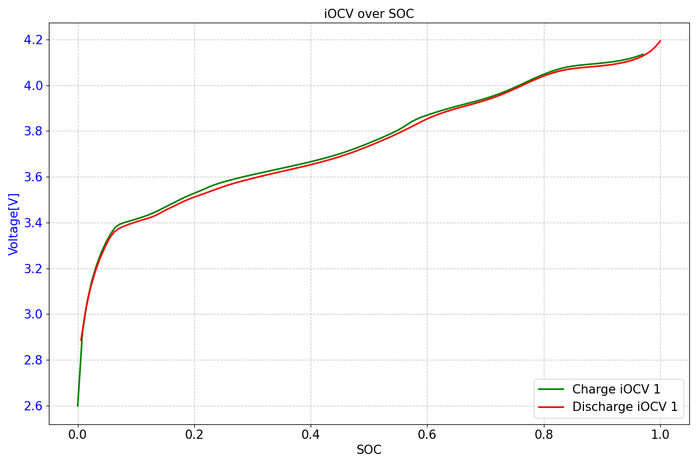
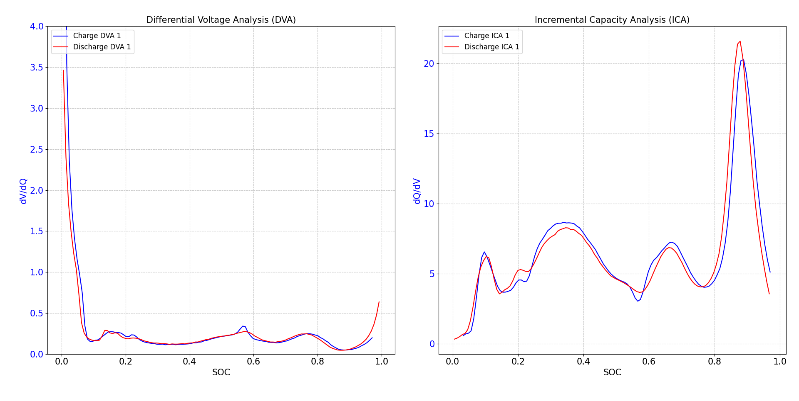

# PPB Extensions for Advanced Battery Analysis

## Table of Contents

- [Overview](#overview)
- [Features](#features)
- [Background](#background)
- [Requirements](#requirements)
- [Usage](#usage)
- [Scope & Limitations](#scope--limitations)

## Overview

This repository extends the **PPB package** for standardized battery cycler measurement data by adding advanced analysis methods for **OCV-based diagnostics** and **incremental capacity analysis**.

The focus of this extension lies on the **automatic extraction of iOCV curves**, the **calculation of ICA and DVA**, as well as **OCV detection methods** designed for dynamic drive cycle simulations (e.g., FUDS).

## Features

- Automatic extraction of **iOCV curves** from cycler measurement data
- Calculation of:
  - **Incremental Capacity Analysis (ICA)**
  - **Differential Voltage Analysis (DVA)**
- Newly developed **OCV detection methods** for:
  - FUDS simulations
  - Likely transferable to other dynamic load profiles
- Fully compatible with standardized PPB data structures
- Designed for reproducible and automated battery diagnostics

## Background

The PPB package provides a standardized interface for battery measurement data obtained from cyclers.  
This extension builds on top of PPB by adding **higher-level electrochemical analysis methods** that are commonly required for:

- Aging and SOH analysis
- Identification of degradation modes
- Evaluation of dynamic drive cycle measurements
- Reproduction of an OCV curve that matches the iOCV discharge curve

Special attention was paid to enabling **automatic detection of iOCV curves**, minimizing manual checking of the datasets.

## Requirements

- **Python** ≥ 3.12
- **pandas** ≥ 2.3.0
- **matplotlib** ≥ 3.10.3
- **scikit-learn** ≥ 1.7.1
- **scipy** ≥ 1.16.0
- **joblib** ≥ 1.5.1

Additional dependencies are inherited from the base PPB package.

## Usage

To use this package extension, there are some limitations; these are explained in the chapter [Scope & Limitations](#scope--limitations).

To successfully use the functions for iOCV detection and the calculation of ICA and DVA, you need to preprocess the datasets with the PPB package. The resulting data then needs to be run through D. Schröder’s StepAnalyzer. As soon as this is done, you can start extracting the iOCV curves.

To successfully extract the iOCV curves, you need to set some parameters correctly. An example is shown in the picture below:

```
from pathlib import Path
import pandas as pd
from iocv_detection import iocv_detection

df_path = Path(r"C:\python projekte\BA_Repo\pydpeet\src\Alex_BA\res\BA\Parameter_studie\01_verarbeiteteDaten\20231027183923-CheckUp-1-2-AM23NMC00001_Neware_2025-11-12_16-07-45_Data.parquet")
Dataframe = pd.read_parquet(df_path)

iocv_curves = iocv_detection(
                min_pause_lenght=120,
                min_loops = 70,
                visualize=True,
                df = Dataframe,
                soc_c_ref=4.8,
                soc_min_voltage=2.49,
                soc_max_voltage=4.22
                )

```
The standard parameters used are:

- **min_pause_length** | standard value is `120` seconds (int). Defines the minimum pause length of a pause segment.
- **min_loops** | standard value is `70` (int). Defines the minimum number of repeating segments (pause + charge or discharge). This is used to determine a sequence for iOCV detection.
- **soc_max_voltage** | standard value is `4.21` (float). Used for SOC calculation based on J. Kalisch’s function. Defines the maximum battery voltage.
- **soc_min_voltage** | standard value is `2.49` (float). Used for SOC calculation based on J. Kalisch’s function. Defines the minimum battery voltage.
- **soc_c_ref** | standard value is `4.8` (float). Used for SOC calculation based on J. Kalisch’s function. Contains the reference capacity of the battery.
- **df** | standard value is `None`. A pandas DataFrame containing the dataset (result of PPB preprocessing).
- **df_primitives** | standard value is `None`. A pandas DataFrame containing the output of `StepAnalyzer_primitives` (primitive data).

It’s important that either **df** or **df_primitives** is passed into the function.

**Optional parameter:**

- **visualize** | standard value is `True`. Activates/deactivates plotting of the iOCV curves (voltage over SOC).

### DVA and ICA calculation

For the calculation of DVA and ICA, it’s important to note that currently this is only used on iOCV curves. The parameters are identical to those used in iOCV detection, because the iOCV extraction is called internally to obtain the curves.

```
from pathlib import Path
import pandas as pd
from dva_ica import compute_dva_ica

df_path = Path(r"C:\python projekte\BA_Repo\pydpeet\src\Alex_BA\res\BA\Parameter_studie\01_verarbeiteteDaten\20231027183923-CheckUp-1-2-AM23NMC00001_Neware_2025-11-12_16-07-45_Data.parquet")
Dataframe = pd.read_parquet(df_path)

dva_ica_dataframe = compute_dva_ica(
                 min_pause_lenght=120,
                 min_loops = 70,
                 visualize=True,
                 df = Dataframe,
                 soc_c_ref=4.8,
                 soc_min_voltage=2.49,
                 soc_max_voltage=4.22,
                 savgol=True,
                 savgol_window_lenght_percentage=0.05
                 )

```

The only added parameters are two optional parameters:

- **savgol** | standard value is `False` (bool). Triggers whether the DVA and ICA curves should be filtered with a Savitzky–Golay window filter.
- **savgol_window_length_percentage** | standard value is `0.07` (float). Sets the window length for Savitzky–Golay filtering (in percent).

when everything is runned correctly your plot should look something like this:

iocv extraction example plot:


DVA/ICA calculation example plot:

## Scope & Limitations

### Scope

- Battery measurement data from Neware cyclers
- Preprocessed PPB datasets

### Limitations

- The iOCV detection is currently only tested on Neware battery measurement datasets. Every dataset needs to be processed through the PPB package and afterwards through the StepAnalyzer as mentioned above.
- For other battery measurement datasets, it is not guaranteed that the iOCV detection (and DVA/ICA) will work.
- For other battery measurements, the StepAnalyzer configuration needs to be adapted (for more information, visit the StepAnalyzer README).
- Every measurement dataset needs the best possible SOC calculation to get the best results. The battery min/max voltage and reference capacity need to be set correctly (sometimes requiring trial and error to find suitable parameters).
